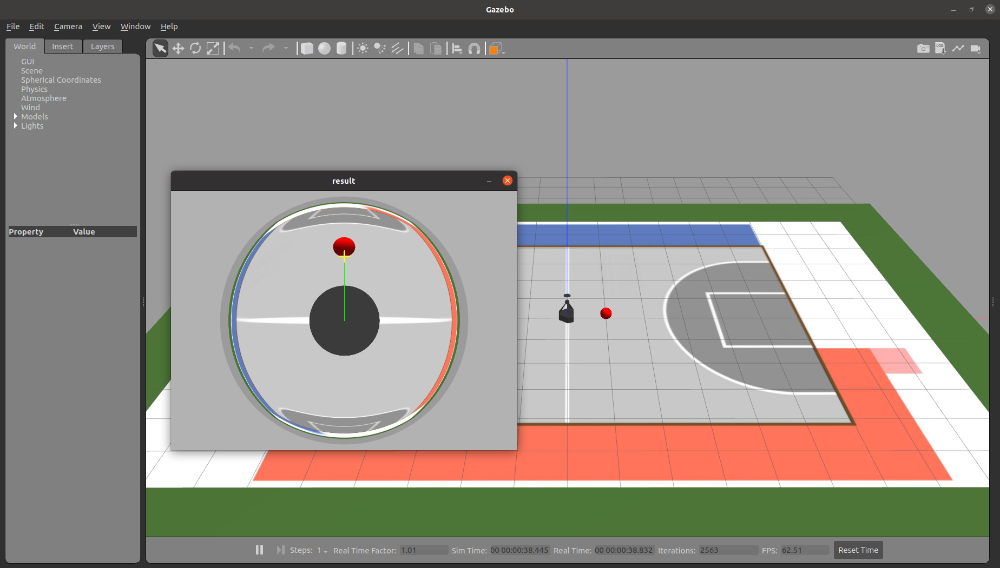
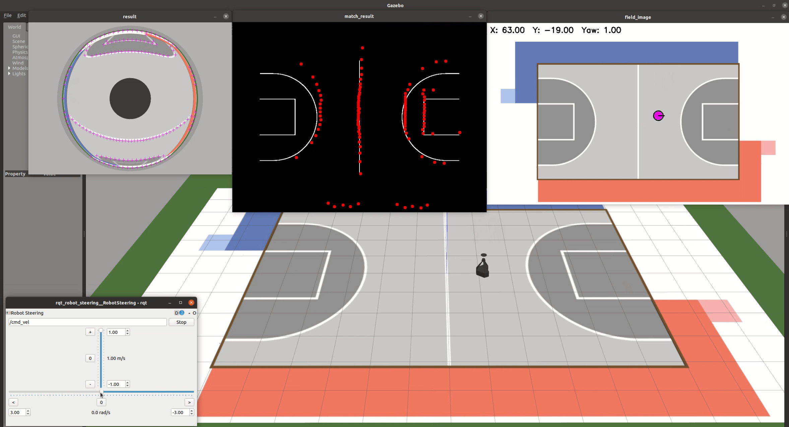

# ConQU2025 R2视觉实机代码
### Adapted from **RoboCon2025 技术验证项目**

## 视频介绍
技术概况: [为 RoboCon 2025 抛个砖 - 足球机器人技术分享](https://www.bilibili.com/video/BV17KpTeaEvU/)   
实战效果: [RoboCup 2017 机器人世界杯夺冠之旅](https://www.bilibili.com/video/BV1q4411K7Z6/)  
入门课程: [机器人操作系统ROS 快速入门教程](https://www.bilibili.com/video/BV1BP4y1o7pw/)  
定位方法: [基于 ROS 的 RoboCon 2025 纯视觉定位方法分享](https://www.bilibili.com/video/BV1RYwYejEzx/)  
剔除干扰: [RoboCon 2025 红蓝边界的妙用](https://www.bilibili.com/video/BV1GMFseyEKc/) 

## 系统版本

- ROS Noetic (Ubuntu 20.04)

## 使用说明

1. 获取源码:
```
cd ~/catkin_ws/src/
git clone https://github.com/6-robot/wpr_simulation.git
git clone https://github.com/6-robot/robocon25_proof.git
```
或者从gitee获取
```
cd ~/catkin_ws/src/
git clone https://gitee.com/s-robot/wpr_simulation.git
git clone https://gitee.com/s-robot/robocon25_proof.git
```
2. 安装依赖项:  
```
cd ~/catkin_ws/src/wpr_simulation/scripts
./install_for_noetic.sh
```
3. 编译
```
cd ~/catkin_ws
catkin_make
```

[1]距离标定:
```
roslaunch conqu_localization calibrate_dist.launch
```


[2]视觉定位:
```
roslaunch conqu_localization localization.launch
```
另外一个终端运行:
```
rosrun rqt_robot_steering rqt_robot_steering
```

